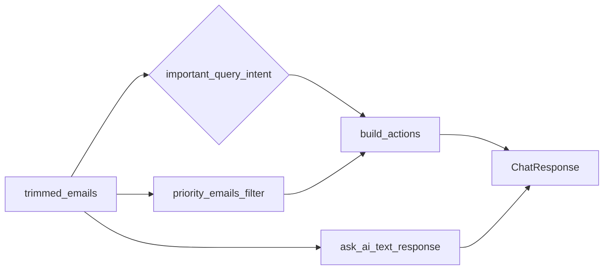

# Actionable email items in Chat API

## Goal

Satisfy TL: when the user asks about important mail, the API returns **one structured row per important email** for UI buttons (Open / Reply later), while keeping today’s plain-text `[ChatResponse.response](D:/mail_assistant/app/models.py)` for narration.

## Design principle (avoid TL pitfalls)

- **Do not** ask the model to emit JSON for `actions`. That reintroduces formatting drift and hallucinated IDs.
- **Do** build `actions` in the backend from the same emails already loaded after `[sanitize_emails](D:/mail_assistant/app/preprocess.py)` and `[trim_to_fit](D:/mail_assistant/app/routes/chat.py)`, using the existing deterministic `priority` flag.

## 1. API schema (`[app/models.py](D:/mail_assistant/app/models.py)`)

Add small Pydantic models (typed, OpenAPI-friendly):

- `EmailActionItem` (example fields; adjust names to match frontend contract):
  - `id: str` — provider email id when present; otherwise a stable synthetic id (e.g. index-based only within this response is fragile; prefer hashing normalized `(from, subject)` if id missing).
  - `title: str` — email subject (fallback `"No subject"`).
  - `from_label: str` — human-facing sender label (derive from normalized `from`: show full address or local-part; keep simple).
  - `action_type: Literal["view", "reply"]` — start with `"view"` until deep links exist; `"reply"` when you want compose UX (optional same phase).
  - `priority: Literal["high", "normal"]` — `"high"` for rows sourced from `priority=True`.

Extend `ChatResponse`:

- `actions: list[EmailActionItem] | None = None`

Default `None` preserves backward compatibility for clients that ignore new fields.

## 2. Query intent (`[app/filters.py](D:/mail_assistant/app/filters.py)`)

Add a tiny helper, e.g. `wants_actionable_priority(query: str) -> bool`, matching phrases like: important, priority, urgent, needs attention, action (keep list short; unit-test edge cases).

Use this to decide **when** to attach `actions`, so normal “summarize inbox” responses are not cluttered unless the user asks for importance/actions.

## 3. Deterministic builder (`[app/preprocess.py](D:/mail_assistant/app/preprocess.py)` or small new `[app/actions.py](D:/mail_assistant/app/actions.py)`)

Implement `build_priority_actions(emails: list[dict]) -> list[EmailActionItem]`:

- Input: final `emails` list after trim (same order as context).
- Filter: `e.get("priority") is True`.
- Output: **one `EmailActionItem` per priority email**, preserving order (typically newest-first after `[sort_by_received_at_desc](D:/mail_assistant/app/preprocess.py)`).

Optional safety caps (if TL worries about 50 buttons):

- Limit to first N (e.g. `settings.max_emails` already bounds batch size; likely no extra cap needed).

## 4. Wire into chat route (`[app/routes/chat.py](D:/mail_assistant/app/routes/chat.py)`)

After `priority_count` / `non_priority_count` are computed from the trimmed list:

- If `wants_actionable_priority(body.query)` and `priority_count > 0`:
  - `actions = build_priority_actions(emails)`
- Else:
  - `actions = None`

Pass into `ChatResponse(actions=actions)`.

Early-return paths (empty batch, no today match, sender filter miss, trim empty) keep `actions=None`.

## 5. Prompt alignment (`[app/ai.py](D:/mail_assistant/app/ai.py)`) — minimal

Add **one** system rule only when `actions` will be non-null (pass a boolean `include_action_guidance` from route), along the lines of:

- Narrative must briefly acknowledge each priority email separately (no merging into one vague sentence), without contradicting server FACTS counts.

Avoid requiring the model to output structured actions.

## 6. Tests (`[tests/test_chat.py](D:/mail_assistant/tests/test_chat.py)`, `[tests/test_filters.py](D:/mail_assistant/tests/test_filters.py)` or new `tests/test_actions.py`)

- Intent **true** + fixture emails with 2 `priority=True` → `len(actions)==2`, stable ids, correct titles/from labels.
- Intent **false** + same fixture → `actions is None` (or absent).
- Intent **true** + zero priority emails → `actions is None`.

## Explicit non-goals (keep scope small)

- No automatic send-mail; no fetching missing metadata from provider beyond current email dict.
- No `open_link` until you have a real URL field from API; map everything to `view`/`reply` initially.

